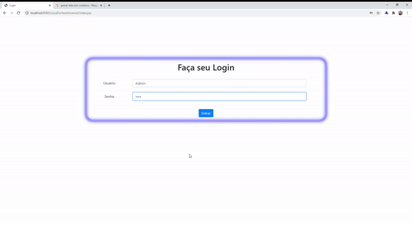

# LocadoraJava

## Descrição do Projeto

	Primeiramente você terá dois tipos de login, um com o usuário "Admin" e outro com o usuário "Balcao", a senha pode ser qualquer coisa.

· Cadastro de clientes;
	- Para verificar esta funcionalidade, clique no menu "Cadastro de Clientes" e depois em "Cadastrar", preencha os dados e clique em "Cadastrar".
	
· Cadastro de filmes;
	- Para verificar esta funcionalidade, clique no menu "Filmes" e depois em "Cadastrar", preencha os dados e clique em "Cadastrar".

· Locação de Filmes;
	- Para verificar esta funcionalidade, clique no menu "Locações" e depois em "Cadastrar", preencha os dados e clique em "Finalizar Locação".
	
· Cálculo de multas por atraso;
	- Para verificar esta funcionalidade, clique no menu "Locações" e depois em "Visualizar", encontre a locação que deseja marcar como atrasada e clique em "Em Atraso", 
informe os dias de atraso, a forma de pagamento e clique em "Finalizar Pagamento", veja que no banco de dados o valor da locação foi alterado para 2 reais a mais a cada
dia de atraso, veja também que a coluna "Entregue" ficará com o valor "A" que significa que o filme foi entregue com atraso.

· Função de Pagamentos;
	- Para verificar esta funcionalidade, clique no menu "Locações" e depois em "Visualizar", encontre a locação que deseja marcar como entregue e clique em "Finalizar",
informe a forma de pagamento e clique em "Finalizar Pagamento", veja que no banco de dados a locação teve uma alteração na coluna "Entregue", onde o valor está preenchido
com "S" de entregue.
	
· Controle de Cadastro (Cliente e Administrador);
	-Este controle é possível verificar alterando o usuário de "Admin" para "Balcao"

· Filmes mais alguados.
	Para verificar esta funcionalidade, clique no menu "Filmes" e depois em "Mais Alugados", você verá a quantidade de vezes que cada filme foi alugado.

Permissões para usuário do tipo “Atendente”

	Para verificar isso, você deve estar logado com o usuário "Balcao", não se esqueça!

· Visualizar filmes alugados;
	-Para verificar esta função, clique no menu "Locações" e depois em "Visualizar", lembrando que deverá ter uma locação em aberto no sistema!

· Visualizar filmes que ele pode alugar
	-Esse é bem legal, lembra que ao cadastrar um filme você informa a quantidade no estoque? Pois é, cada vez que você aluga um filme, esta quantidade dimuinui,
quando ela chegua no "0", não será possível mais alugar o filme. Para ver os filmes disponíveis, entre no menu "Locações" e depois em "Cadastrar", na opção "Selecione o Filme:"
mostrará somente os filmes que estão disponíveis no estoque.

· Visualizar data de entrega dos filmes alugados.
	Para isso vá para o menu "Locações" e depois em "Visualizar", veja que nas locações mostrará a data de entrega que foi cadastrada lá na hora de criar uma nova locação;

Permissões para usuário do tipo “Administrador”

	Para verificar isso, você deve estar logada com o usuário "Admin", não se esqueça!

· Visualizar listagem de filmes;
	- Para verifica esta funcionalidade, clique no menu "Filmes" e depois em "Visualizar"

· Adicionar Filmes;
	- já expliquei lá em cima
	
· Remover Filmes;
	- Para verificar esta funcionalidade, clique no menu "Filmes" e depois em "Visualizar", agora clique em "Excluir", o filme será removido do banco de dados e da visualização.
	
· Visualizar Filmes alugados;
	-Para verificar esta função, clique no menu "Locações" e depois em "Visualizar", lembrando que deverá ter uma locação em aberto no sistema!
	
· Visualizar Clientes que atrasaram a entrega.
	Para isso clique em "Cadastro de Clientes" e depois em "Já atrasaram", mostrará uma listagem de clientes que já atrasaram a entrega;

# Configuração do banco de dados:
	A porta de entrada do banco de dados deve ser 3306.
	O usuário para conexão deve ser "root".
	A senha para conexão deve ser 1234.

## Desenvolvido por:
<b>Micael Trivelato</b>

